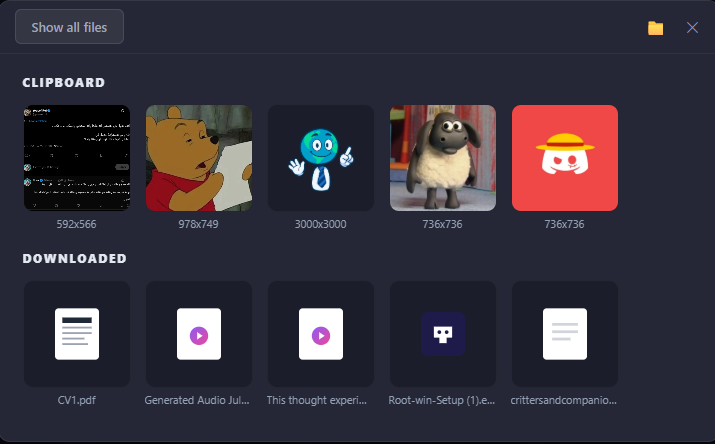
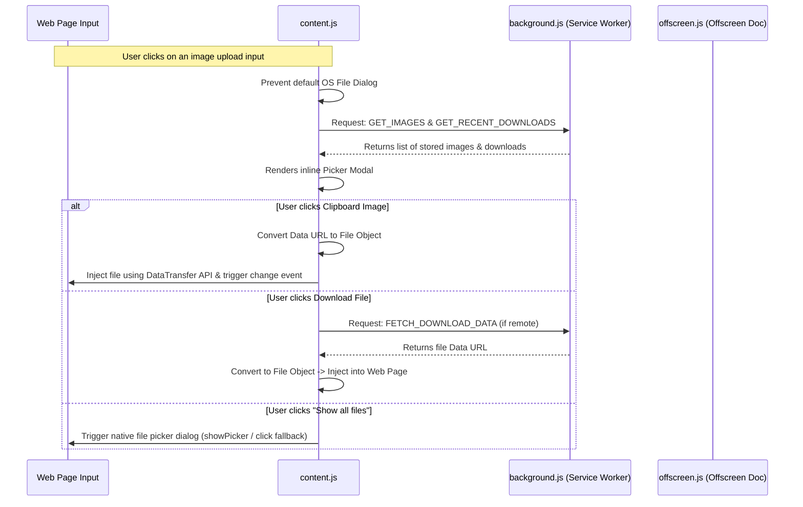

# Clipboard & Downloads Upload Manager 📋🚀

An elegant, developer-friendly Chrome/Edge extension (Manifest V3) designed to optimize file uploading workflows. Instead of repeatedly traversing your operating system's file explorer when clicking an upload button, this extension intercepts file input clicks and displays a beautiful overlay modal with your **recent clipboard images** and **downloaded files** for instant, one-click uploading.

---

## 🌟 Key Features

* **Instant Clipboard Injections:** Copies system clipboard image content automatically and stores it inside Chrome's local storage (`chrome.storage.local`). Selecting an item instantly populates the target file input.
* **Auto-Clipboard Monitoring:** Leverages the Manifest V3 **Offscreen Document API** to monitor and capture clipboard images on window focus, tab change, or copying events without interrupting user flow.
* **Download History Integration:** Fetches and displays recent downloads via the Chrome downloads history API.
* **Local System Downloads Folder Integration:** Connects physical disk storage folders directly through the **File System Access API** (`showDirectoryPicker`). This allows the extension to scan files on disk locally and bypass browser download history constraints.
* **Intuitive Modal UI:** Injects a keyboard-accessible modal overlay (press `Esc` to dismiss) when target file inputs are clicked. Includes a fallback button ("Show all files") to trigger the default native OS picker.
* **Site Blacklisting:** Includes a global popup panel with a domain toggle to easily enable or disable the overlay on specific sites.
* **Robust Gemini Integration:** Custom handlers built specifically to support rich text editors and custom upload sequences on websites like Google Gemini.

---

## 📁 Repository Structure

* [`manifest.json`](manifest.json): Extension configuration detailing permissions (`storage`, `offscreen`, `downloads`), scripts, and matches.
* [`background.js`](background.js): The extension's service worker. Manages the offscreen document, handles storage operations, monitors active tabs, and coordinates background message passing.
* [`content.js`](content.js) & [`content.css`](content.css): Scripts and styles injected into web pages. Captures input clicks, renders the picker modal, handles direct clipboard queries, and performs file injection via standard `DataTransfer` APIs.
* [`offscreen.html`](offscreen.html) & [`offscreen.js`](offscreen.js): Lightweight background document specifically generated to bypass Service Worker limitations, reading the system clipboard asynchronously.
* [`popup.html`](popup.html), [`popup.js`](popup.js), & [`popup.css`](popup.css): The browser toolbar popup panel allowing users to manually paste the clipboard, delete stored images, toggle domain activation, or clear all saved files.
* [`test.html`](test.html): A sandboxed testing environment for development verification.

---

## 🚀 How it Works (Architecture Flow)

### The Clipboard Monitoring Flow
In Chrome Manifest V3, background service workers cannot read the system clipboard directly. To solve this:
1. When a user focuses a window or activates a tab, the service worker (`background.js`) wakes up and creates a temporary **Offscreen Document** (`offscreen.html`).
2. The offscreen document runs in a DOM context and reads clipboard contents via `navigator.clipboard.read`.
3. If an image is detected, it is sent back to the service worker and stored in `chrome.storage.local`.
4. When a user clicks a file upload field on a web page, the content script fetches the stored images and renders them in the custom gallery overlay.

---

## 🛠️ Installation & Setup (Local Development)

Since this extension is not yet published on the Chrome Web Store, you can run it locally in developer mode:

1. Clone or download this repository.
2. Open Google Chrome (or any Chromium-based browser like Microsoft Edge or Brave).
3. Navigate to `chrome://extensions/`.
4. Turn on the **Developer mode** toggle switch in the top-right corner.
5. Click the **Load unpacked** button in the top-left corner.
6. Choose the repository folder (`Image clipboard`).
7. (Optional) Pin the extension to your toolbar for easy access.

---

## 🔒 Security & Privacy

All file operations, clipboard readings, and folder scans occur **entirely locally** on your device.
* The `storage` API is used solely to cache your recent uploads on your machine.
* The `downloads` and `offscreen` APIs are locked to sandboxed operations.
* No telemetry or external server communication is established; your uploads never leave your browser context.
