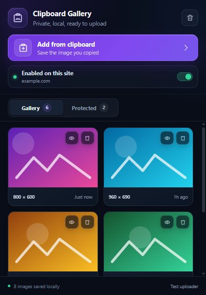
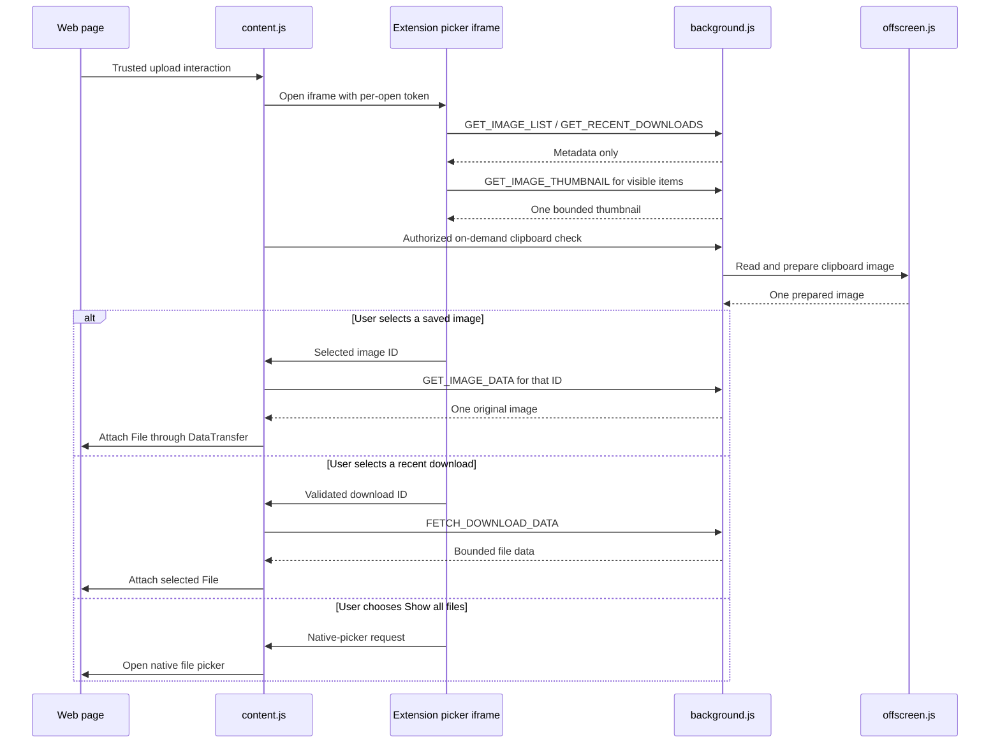

# Clipboard & Downloads Upload Manager

A Manifest V3 extension for Chrome, Edge, and Brave that makes repeated uploads faster. When an enabled page opens an eligible file input, the extension presents an extension-owned picker containing saved clipboard images and recent browser downloads. The native operating-system picker remains available through **Show all files**.

The gallery is stored locally, loads metadata before image data, and never sends the complete gallery through one extension message.



## Main features

- **Clipboard gallery:** Keep up to 50 recent Gallery images, protect important images from automatic rotation, and restore or delete individual items.
- **On-demand clipboard sync:** Read the system clipboard only after an explicit popup action or an eligible upload interaction.
- **Recent downloads:** Show recent browser-download metadata and attach a selected item when its original HTTP(S) URL can be fetched safely.
- **Extension-owned upload picker:** Render the picker in an extension-origin iframe rather than in page-owned DOM.
- **Per-site control:** Enable or disable upload interception for the active hostname from the toolbar popup.
- **Native fallback:** Open the normal operating-system file picker at any time with **Show all files**.
- **Large-gallery compatibility:** Migrate the previous aggregate storage format incrementally without deleting the original data before commit.

## Toolbar popup

The redesigned popup separates controls, status, and gallery content:

- **Add from clipboard** shows a busy state while an image is read and reports whether it was saved or was already the newest item.
- The **site switch** shows the active hostname and immediately enables or disables interception on that site.
- **Gallery** and **Protected** tabs include live counts.
- Image cards expose protect/restore and delete actions without rebuilding the entire gallery.
- Clearing the gallery requires a second click on the trash button to reduce accidental deletion.
- The footer reports how many images are stored locally and links to the test uploader.

Loading has explicit visual states instead of an empty or frozen panel:

1. Initial metadata loading displays skeleton cards.
2. Existing cards remain visible during quiet refreshes.
3. Previews are requested only near the viewport, decoded, and then faded in.
4. Legacy migration displays a progress banner and partial results as records become available.
5. Recoverable failures display a message and a **Retry** action.

The first preview of an older image can take longer because its thumbnail may need to be generated. Generated thumbnails are stored separately, so later popup and picker loads do not need to read the full original merely to display a preview.

## Upload picker

The upload picker provides three areas:

- **Clipboard:** Active saved images, loaded from lightweight metadata and lazy thumbnails.
- **Downloaded:** Recent entries from the browser downloads history.
- **Protected:** Important gallery images that do not count toward the 50 recent-image rotation limit, loaded only when that section is opened.

Choose an item to attach it to the page's upload target. Press `Esc`, use the close button, or click outside the picker to dismiss it. Use **Show all files** when a website requires the native picker or a recent download cannot be fetched.

## Data and message architecture

Images are no longer kept in one large `clipboardImages` array. The current format uses:

- a small metadata index for ordering, dimensions, timestamps, and protected state;
- one storage record per original image;
- one separate, bounded storage record per generated thumbnail.

The UI uses a bounded protocol:

- `GET_IMAGE_LIST` returns metadata only;
- `GET_IMAGE_THUMBNAIL` returns one bounded preview;
- `GET_IMAGE_DATA` returns one original only after it is selected.

New images are limited to 6 MiB after preparation. Thumbnails are bounded separately. This design avoids Chrome's 64 MiB extension-message ceiling even when the total local gallery is much larger.



### On-demand clipboard flow

Manifest V3 service workers do not have a normal DOM clipboard context. For a permitted sync, the worker temporarily creates [`offscreen.html`](offscreen.html), reads the clipboard in that document, prepares one image, saves it, and closes the offscreen document. There is no continuous focus, copy, or clipboard polling on web pages.

### Resumable legacy migration

Older versions stored all images in one aggregate value. On upgrade, the worker:

1. records migration intent and progress;
2. copies a small batch of records to separate image keys;
3. checkpoints after each copied record;
4. commits the new metadata index;
5. removes the old aggregate only after the new index has committed.

If the popup closes or the Manifest V3 worker is suspended, migration resumes from the last checkpoint the next time the gallery is requested. The popup shows **Optimizing your gallery** while this runs. Keep it open for the fastest completion, but an interruption does not require starting over.

## Picker security model

The picker is a web-accessible extension page because it must appear over the current website, but it is not rendered in the website's light DOM:

- `content.js` places it inside a **closed shadow root** as an extension-origin iframe.
- Each opening receives a random 128-bit capability token.
- Host/picker messages validate the iframe window, extension origin, parent origin, token, and message shape.
- Automatic clipboard reads require a short-lived, one-use session bound to the originating browser tab.
- Picker actions require trusted user events.
- The original clipboard image is requested only after the user selects its ID; the host page then receives only the explicitly selected file.
- Extension storage is restricted to trusted extension contexts where the browser supports `storage.local.setAccessLevel`.

Gallery processing stays on the device. The extension contains no telemetry. Selecting a recent download can make a network request to that download's original HTTP(S) URL; responses are size-limited, and the native picker is the fallback. Incognito use is disabled by the manifest.

## Repository structure

- [`manifest.json`](manifest.json): Manifest V3 configuration, permissions, content scripts, and picker resources.
- [`background.js`](background.js): Service worker for storage, migration, bounded messages, downloads, badges, and picker-session authorization.
- [`content.js`](content.js) and [`content.css`](content.css): Trusted upload interception, picker iframe host, message validation, and file attachment.
- [`picker.html`](picker.html), [`picker.js`](picker.js), and [`picker.css`](picker.css): Extension-origin upload picker.
- [`popup.html`](popup.html), [`popup.js`](popup.js), and [`popup.css`](popup.css): Toolbar popup, gallery management, loading states, and site control.
- [`offscreen.html`](offscreen.html) and [`offscreen.js`](offscreen.js): Temporary clipboard and image-processing DOM context.
- [`test.html`](test.html) and [`test.js`](test.js): Local upload-integration test page.
- [`tests/background.protocol.test.js`](tests/background.protocol.test.js): Message-size and thumbnail-storage regression coverage.
- [`tests/background.migration.test.js`](tests/background.migration.test.js): Restart, failure, collision, cleanup, and migration recovery coverage.

## Installation

Chrome 109 or newer is required.

1. Clone or download this repository.
2. Open the browser's extensions page:
   - Chrome: `chrome://extensions`
   - Brave: `brave://extensions`
   - Edge: `edge://extensions`
3. Enable **Developer mode**.
4. Choose **Load unpacked**.
5. Select the repository folder named `Image clipboard`.
6. Optionally pin the extension to the toolbar.
7. Refresh any already-open websites before testing upload interception.

### Reloading after a source update

Reloading a Manifest V3 extension does not replace content scripts that are already injected into open tabs.

1. Open the browser's extensions page and click **Reload** on this extension.
2. Close and reopen the toolbar popup.
3. Hard-refresh every open site where the extension is used (`Ctrl+Shift+R`), especially long-lived ChatGPT or Gemini tabs. If necessary, close and reopen the tab.
4. Open the popup and let any **Optimizing your gallery** progress finish.

Do not uninstall the extension or clear its storage as a troubleshooting step if the gallery matters; uninstalling an unpacked extension can remove the storage associated with its extension ID.

## Troubleshooting

### `Message exceeded maximum allowed size of 64MiB`

The current UI never requests the whole gallery in one message. Seeing this error after updating almost always means an old `content.js` is still running in a tab or an older unpacked copy of the extension is still enabled.

1. Reload the extension from `chrome://extensions`, `brave://extensions`, or `edge://extensions`.
2. Hard-refresh **every** open page on which the extension ran. A normal extension reload alone is not enough.
3. Close and reopen the popup.
4. Clear the DevTools console before reproducing; existing console entries remain visible after a successful reload.
5. Check the extensions page for a second older unpacked copy. Disable the duplicate rather than uninstalling the copy that owns your gallery.
6. Keep the popup open while a legacy gallery migration is progressing, then retry the upload.

A fresh occurrence from a current tab should return a small `REFRESH_REQUIRED` response rather than transferring the old aggregate gallery.

### The popup is loading slowly after an upgrade

Keep it open while the migration progress banner advances. Migrated cards appear progressively. The first view of an image may also generate a thumbnail; later views use the separate thumbnail cache.

### The popup reports that the extension was updated

Close and reopen the popup, then refresh the affected website tab. This replaces invalidated extension contexts.

### Clipboard sync finds no image

Copy an actual bitmap image, then click **Add from clipboard** again. Plain text, a filesystem path, or a copied filename is not an image clipboard item. Browser clipboard policies require the explicit user action.

### The picker does not open

- Confirm the popup says the extension is enabled on the current hostname.
- Refresh the page after loading or reloading the extension.
- Try the included **Test uploader** page.
- Browser-internal pages such as `chrome://` and extension-store pages do not allow normal content-script injection.

### A recent download cannot be attached

The browser history entry may point to an expired, authenticated, local, or oversized resource. Use **Show all files** and select the downloaded file from the native picker.

## Development checks

From the repository directory:

```powershell
node --check background.js
node --check content.js
node --check picker.js
node --check popup.js
node --check offscreen.js
node tests/background.protocol.test.js
node tests/background.migration.test.js
```
