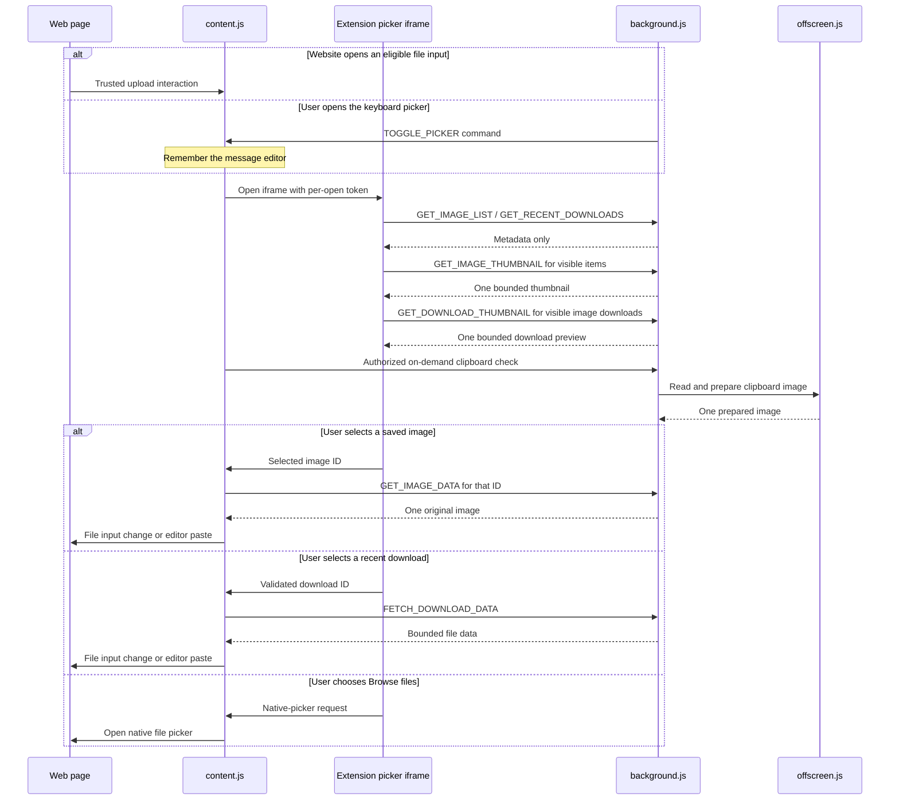

# Clipboard & Downloads Upload Manager

A Manifest V3 extension for Chrome, Edge, and Brave that makes repeated uploads and image pasting faster. When an enabled page opens an eligible file input, the extension presents a picker containing saved clipboard images and recent browser downloads. You can also open it with **Ctrl+Shift+V** to paste a selected image into a message editor. The native operating-system picker remains available through **Browse files**.

**Current version: 1.1.8.** Requires Chromium 111 or newer. Keeping the picker above native browser popovers requires a browser with the Popover API; older browsers use a regular page overlay.

The gallery is stored locally, loads metadata before image data, and never sends the complete gallery through one extension message.


## Main features

- **Clipboard gallery:** Keep up to 50 recent Gallery images, protect important images from automatic rotation, and restore or delete individual items.
- **On-demand clipboard sync:** Read the system clipboard only after an explicit popup action or an eligible upload interaction.
- **Recent downloads:** Show real, bounded previews for supported image and video downloads, keep clear file-type cards for other formats, and attach a selected item when its original HTTP(S) URL can be fetched safely.
- **Extension-owned upload picker:** Render the picker in an extension-origin iframe rather than in page-owned DOM.
- **Keyboard image paste:** Focus a message editor, open the picker with `Ctrl+Shift+V` (`Command+Shift+V` on macOS), and select an image to send through the editor's paste handler. Customize the shortcut in your browser's extension settings.
- **Dark interface:** A shared charcoal theme, muted sage accent, flat tabs, and larger image previews across the popup and picker.
- **Toolbar popup:** Access quick site controls, recent clipboard items, and protected images.
- **Native fallback:** Open the normal operating-system file picker at any time with **Browse files**.
- **Programmatic upload support:** Intercept user-triggered `input.click()` and `input.showPicker()` calls, including file inputs created outside the DOM. Deliver the selected image to the original input's change handler.
- **Overlay compatibility:** Place the picker above existing browser popovers where supported, and keep clicks inside its dialog from accidentally dismissing it.
- **Large-gallery compatibility:** Migrate the previous aggregate storage format incrementally without deleting the original data before commit.

## Toolbar popup

The dark popup and upload picker share a warm charcoal palette, a muted sage accent, plain source tabs, and larger image previews. Controls, status, and gallery content have a consistent hierarchy:

- **Add from clipboard** shows a busy state while an image is read and reports whether it was saved or was already the newest item.
- The **site switch** shows the active hostname and immediately enables or disables interception on that site.
- **Gallery** and **Protected** tabs include live counts.
- Image cards expose protect/restore and delete actions without rebuilding the entire gallery.
- Clearing the gallery requires a second click on the trash button to reduce accidental deletion.
- The footer reports how many images are stored locally and links to the test uploader.

Loading has explicit visual states instead of an empty or frozen panel:

1. Initial metadata loading displays skeleton cards.
2. Existing cards remain visible during quiet refreshes.
3. Previews are requested only near the viewport, decoded, and then faded in.
4. Legacy migration displays a progress banner and partial results as records become available.
5. Recoverable failures display a message and a **Retry** action.

The first preview of an older image can take longer because its thumbnail may need to be generated. Generated thumbnails are stored separately, so later popup and picker loads do not need to read the full original merely to display a preview.

## Upload picker

The upload picker provides three areas:

- **Clipboard:** Active saved images, loaded from lightweight metadata and lazy thumbnails.
- **Downloads:** Recent entries from the browser downloads history. Supported image files and MP4/WebM/Ogg videos load small previews on demand; other files retain a clear type card.
- **Protected:** Important gallery images that do not count toward the 50 recent-image rotation limit, loaded only when that section is opened.

When opened by a website's upload button, choosing an item attaches it to that upload action's original file input. When opened with the keyboard shortcut, choosing an image sends it to the message editor's paste handler.

Click **Select multiple** (or hold `Ctrl`/`Cmd`/`Shift` while clicking) to choose multiple images and downloads, then attach them all together with **Attach selected**. Press `Esc`, use the close button, or click outside the picker to dismiss it. Use **Browse files** when a website requires the native picker or a recent download cannot be fetched.

### Paste an image into a conversation

1. Click inside the conversation's message field.
2. Press **Ctrl+Shift+V** (or **Command+Shift+V** on macOS).
3. Select an image from **Clipboard**, **Downloads**, or **Protected**.
4. Wait for the conversation to display the attached image before sending your message.

The shortcut sends a file through a clipboard paste event; it does not replace the system clipboard. A handled paste is sent once, without a duplicate drop. If the editor does not accept paste, the extension tries its drop handler. If neither accepts the file, the picker stays open and shows an error. Use the site's upload button in that case.

## Data and message architecture

Images are no longer kept in one large `clipboardImages` array. The current format uses:

- a small metadata index for ordering, dimensions, timestamps, and protected state;
- one storage record per original image;
- one separate, bounded storage record per generated thumbnail.

The UI uses a bounded protocol:

- `GET_IMAGE_LIST` returns metadata only;
- `GET_IMAGE_THUMBNAIL` returns one bounded preview;
- `GET_DOWNLOAD_THUMBNAIL` returns one bounded preview for a supported image download;
- `GET_IMAGE_DATA` returns one original only after it is selected.

New images are limited to 6 MiB after preparation. Thumbnails are bounded separately. This design avoids Chrome's 64 MiB extension-message ceiling even when the total local gallery is much larger.


```mermaid
sequenceDiagram
    participant Page as Web page
    participant Host as content.js
    participant Picker as Extension picker iframe
    participant Worker as background.js
    participant Offscreen as offscreen.js

    alt Website opens an eligible file input
        Page->>Host: Trusted upload interaction
    else User opens the keyboard picker
        Worker->>Host: TOGGLE_PICKER command
        Note over Host: Remember the message editor
    end
    Host->>Picker: Open iframe with per-open token
    Picker->>Worker: GET_IMAGE_LIST / GET_RECENT_DOWNLOADS
    Worker-->>Picker: Metadata only
    Picker->>Worker: GET_IMAGE_THUMBNAIL for visible items
    Worker-->>Picker: One bounded thumbnail
    Picker->>Worker: GET_DOWNLOAD_THUMBNAIL for visible image downloads
    Worker-->>Picker: One bounded download preview
    Host->>Worker: Authorized on-demand clipboard check
    Worker->>Offscreen: Read and prepare clipboard image
    Offscreen-->>Worker: One prepared image

    alt User selects a saved image
        Picker->>Host: Selected image ID
        Host->>Worker: GET_IMAGE_DATA for that ID
        Worker-->>Host: One original image
        Host->>Page: File input change or editor paste
    else User selects a recent download
        Picker->>Host: Validated download ID
        Host->>Worker: FETCH_DOWNLOAD_DATA
        Worker-->>Host: Bounded file data
        Host->>Page: File input change or editor paste
    else User chooses Browse files
        Picker->>Host: Native-picker request
        Host->>Page: Open native file picker
    end
```

### On-demand clipboard flow

Manifest V3 service workers do not have a normal DOM clipboard context. For a permitted sync, the worker temporarily creates [`offscreen.html`](offscreen.html), reads the clipboard in that document, prepares one image, saves it, and closes the offscreen document. There is no continuous focus, copy, or clipboard polling on web pages.

### Resumable legacy migration

Older versions stored all images in one aggregate value. On upgrade, the worker:

1. records migration intent and progress;
2. copies a small batch of records to separate image keys;
3. checkpoints after each copied record;
4. commits the new metadata index;
5. removes the old aggregate only after the new index has committed.

If the popup closes or the Manifest V3 worker is suspended, migration resumes from the last checkpoint the next time the gallery is requested. The popup shows **Optimizing your gallery** while this runs. Keep it open for the fastest completion, but an interruption does not require starting over.

## Picker security model

The picker is a web-accessible extension page because it must appear over the current website, but it is not rendered in the website's light DOM:

- `content.js` places it inside a **closed shadow root** as an extension-origin iframe.
- Each opening receives a random 128-bit capability token.
- Host/picker messages validate the iframe window, extension origin, parent origin, token, and message shape.
- Automatic clipboard reads require a short-lived, one-use session bound to the originating browser tab.
- Picker actions require trusted user events.
- The original clipboard image is requested only after the user selects its ID; the host page then receives only the explicitly selected file.
- Extension storage is restricted to trusted extension contexts where the browser supports `storage.local.setAccessLevel`.

Gallery processing stays on the device. The extension contains no telemetry. Selecting a recent download can make a network request to that download's original HTTP(S) URL; responses are size-limited, and the native picker is the fallback. Incognito use is disabled by the manifest.

## Repository structure

- [`manifest.json`](manifest.json): Manifest V3 configuration, permissions, content scripts, and picker resources.
- [`background.js`](background.js): Service worker for storage, migration, bounded messages, downloads, badges, and picker-session authorization.
- [`content.js`](content.js) and [`content.css`](content.css): Trusted upload interception, picker iframe host, message validation, and file attachment.
- [`ui-theme.css`](ui-theme.css): Shared dark palette, typography, and interface tokens for the popup and picker.
- [`page-file-picker.js`](page-file-picker.js): Small page-world adapter for programmatic file pickers; no extension APIs or gallery access.
- [`picker.html`](picker.html), [`picker.js`](picker.js), and [`picker.css`](picker.css): Extension-origin upload picker.
- [`popup.html`](popup.html), [`popup.js`](popup.js), and [`popup.css`](popup.css): Toolbar popup, gallery management, loading states, and site control.
- [`offscreen.html`](offscreen.html) and [`offscreen.js`](offscreen.js): Temporary clipboard and image-processing DOM context.
- [`test.html`](test.html) and [`test.js`](test.js): Local upload-integration test page.
- [`tests/background.protocol.test.js`](tests/background.protocol.test.js): Message-size and thumbnail-storage regression coverage.
- [`tests/background.migration.test.js`](tests/background.migration.test.js): Restart, failure, collision, cleanup, and migration recovery coverage.
- [`tests/background.download-preview.test.js`](tests/background.download-preview.test.js): Download-preview limits, caching, sender validation, and type fallback coverage.
- [`tests/picker.relay.test.js`](tests/picker.relay.test.js): Picker Close/selection relay, deduplication, fast-click, and worker-restart coverage.
- [`tests/content.upload.browser.test.js`](tests/content.upload.browser.test.js): Real Chromium DOM tests across page and isolated worlds, with mocked extension transport.
- [`tests/extension.upload.browser.test.js`](tests/extension.upload.browser.test.js): Actual unpacked-extension tests for upload inputs, Flow-style popovers, shortcut paste, and exact selected file bytes.
- [`tests/render-ui.js`](tests/render-ui.js): Desktop and compact UI preview rendering.

## Installation

Chrome 111 or newer is required.

1. Clone or download this repository.
2. Open the browser's extensions page:
   - Chrome: `chrome://extensions`
   - Brave: `brave://extensions`
   - Edge: `edge://extensions`
3. Enable **Developer mode**.
4. Choose **Load unpacked**.
5. Select the repository folder named `Image clipboard`.
6. Optionally pin the extension to the toolbar.
7. Refresh any already-open websites before testing upload interception.

### Reloading after a source update

Reloading a Manifest V3 extension does not replace content scripts that are already injected into open tabs.

1. Open the browser's extensions page and click **Reload** on this extension.
2. Close and reopen the toolbar popup.
3. Hard-refresh every open site where the extension is used (`Ctrl+Shift+R`), including Flow, ChatGPT, and Gemini tabs. If necessary, close and reopen the tab.
4. Open the popup and let any **Optimizing your gallery** progress finish.

Do not uninstall the extension or clear its storage as a troubleshooting step if the gallery matters; uninstalling an unpacked extension can remove the storage associated with its extension ID.

## Troubleshooting

### `Message exceeded maximum allowed size of 64MiB`

The current UI never requests the whole gallery in one message. Seeing this error after updating almost always means an old `content.js` is still running in a tab or an older unpacked copy of the extension is still enabled.

1. Reload the extension from `chrome://extensions`, `brave://extensions`, or `edge://extensions`.
2. Hard-refresh **every** open page on which the extension ran. A normal extension reload alone is not enough.
3. Close and reopen the popup.
4. Clear the DevTools console before reproducing; existing console entries remain visible after a successful reload.
5. Check the extensions page for a second older unpacked copy. Disable the duplicate rather than uninstalling the copy that owns your gallery.
6. Keep the popup open while a legacy gallery migration is progressing, then retry the upload.

A fresh occurrence from a current tab should return a small `REFRESH_REQUIRED` response rather than transferring the old aggregate gallery.

### The popup is loading slowly after an upgrade

Keep it open while the migration progress banner advances. Migrated cards appear progressively. The first view of an image may also generate a thumbnail; later views use the separate thumbnail cache.

### The popup reports that the extension was updated

Close and reopen the popup, then refresh the affected website tab. This replaces invalidated extension contexts.

### Clipboard sync finds no image

Copy an actual bitmap image, then click **Add from clipboard** again. Plain text, a filesystem path, or a copied filename is not an image clipboard item. Browser clipboard policies require the explicit user action.

### The picker does not open

- Confirm the popup says the extension is enabled on the current hostname.
- Refresh the page after loading or reloading the extension.
- Try the included **Test uploader** page.
- Browser-internal pages such as `chrome://` and extension-store pages do not allow normal content-script injection.

### A recent download cannot be attached

The browser history entry may point to an expired, authenticated, local, or oversized resource. Use **Browse files** and select the downloaded file from the native picker.

### Google Flow: upload buttons and conversation paste

Enable the extension on `flow.google.com`, reload it after updating, and hard-refresh Flow. Its toolbar upload, prompt attachment menu, and keyboard paste use different paths:

| Action | How to use it | Extension behavior |
| --- | --- | --- |
| Toolbar upload | Open the top-right **Add media** menu and choose **Upload**. | Deliver the selected file to Flow's temporary file input. |
| Prompt attachment menu | Open **Add ingredients to the prompt box → Upload media**. | Keep the picker above Flow's native popover so its pending uploader remains alive. |
| Paste into the conversation | Click the message field, then press **Ctrl+Shift+V** and choose an image. | Send the image through the editor's clipboard paste handler, without reusing an earlier upload input. |

If another component covers the picker, confirm you are running **1.1.8**, then reload the extension and refresh Flow. A normal `z-index` cannot appear above a native browser popover; the current picker uses the browser's top layer where available. Clicks inside its closed-shadow dialog also stay separate from backdrop dismissal.

The toolbar upload was confirmed working by the user, and the corrected layer ordering was observed on the live Flow page. Automated tests pass for toolbar uploads, the prompt-menu lifecycle, and shortcut paste using a local fixture modeled on Flow's inspected upload and image-paste handlers. End-to-end image attachment through the prompt menu and **Ctrl+Shift+V** on the live authenticated Flow page still needs user confirmation; the automated fixture is not that confirmation.

### Compatibility limits

Browser-internal pages, upload widgets inside child frames, File System Access API pickers, and sites requiring trusted native change or paste events may require the site's native upload flow. The keyboard picker needs a message editor that accepts image paste or file drop; opening the gallery does not by itself guarantee attachment.

## Development checks

From the repository directory:

```powershell
node --check background.js
node --check content.js
node --check page-file-picker.js
node --check picker.js
node --check popup.js
node --check offscreen.js
Get-ChildItem tests -Filter '*.test.js' |
    Where-Object { $_.Name -notlike '*browser.test.js' } |
    ForEach-Object {
        node $_.FullName
        if ($LASTEXITCODE -ne 0) { throw "Failed: $($_.Name)" }
    }
```

With Playwright available:

```powershell
node tests/content.upload.browser.test.js
node tests/extension.upload.browser.test.js
node tests/render-ui.js
```

- The content-script browser test uses real Chromium DOM and separate page/isolated worlds with mocked extension transport. It covers detached inputs, native fallback, pointer and keyboard activation, site disabling, and paste into the focused editor after a prior upload.
- The full extension test loads the unpacked extension in a disposable profile and exercises its actual picker, service worker, and file delivery. It checks Flow-style native popovers, shortcut paste, exact selected image bytes, and backdrop dismissal. It requires a recent Chrome build supporting DevTools `Extensions.loadUnpacked`; its debugging flag applies only to the temporary test profile.
- The UI renderer saves desktop and compact previews under `tmp/ui-preview`.

Set `CHROMIUM_EXECUTABLE_PATH` when using an installed Chrome instead of Playwright's bundled browser; use `NODE_PATH` if Playwright is supplied by a separate workspace runtime. These checks do not upload files to a live Flow account.
